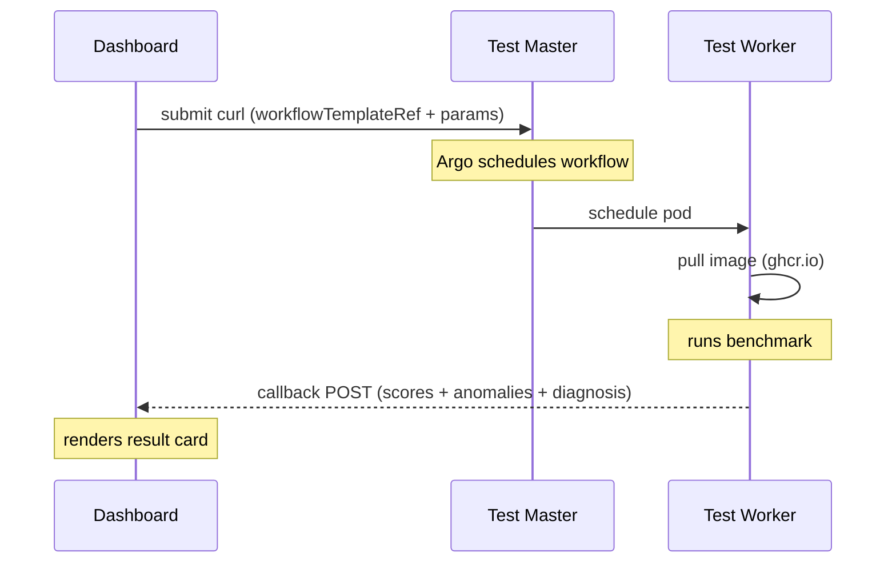

# Stressmaster Benchmark API Reference
## module-stresser — Benchmark Modules

> **Base URL:** `https://10.255.32.82:32746`
> **Auth:** Bearer token on every request
> **TLS:** Self-signed cert — use `-k` flag on curl

---

## Authentication

Retrieve token at any time from stressmaster:

```bash
kubectl get secret stress-ui-sa-token -n stress \
  -o jsonpath='{.data.token}' | base64 -d
```

Set environment variables:

```bash
export ARGO="https://10.255.32.82:32746"
export ARGO_TOKEN=$(kubectl get secret stress-ui-sa-token -n stress \
  -o jsonpath='{.data.token}' | base64 -d)
export CALLBACK="http://<ui-vm-ip>:3000/api/callback"
```

---

## Module Overview

| Module | WorkflowTemplate | Measures | Runtime |
|--------|-----------------|----------|---------|
| **STREAM** | `stream-bench` | Memory bandwidth — Copy, Scale, Add, Triad in MB/s | <1 min |
| **7-zip** | `7zip-bench` | CPU integer performance — compression/decompression MIPS, single vs multi-thread scaling | <1 min |
| **iperf3** | `iperf3-bench` | Network — TCP upload/download/bidirectional bandwidth, UDP jitter and packet loss | ~90 sec |
| **fio** | `fio-bench` | IO — sequential and random read/write throughput, IOPS, and latency percentiles | ~2 min |
| **LMbench** | `lmbench-bench` | Memory latency across cache hierarchy — L1, L2, L3, RAM in nanoseconds | <1 min |
| **SPEC CPU 2017** | `spec-bench` | *(future work — see below)* | unk |

All benchmark modules:
- Run on a specific worker node via `target-node`
- Send an enriched callback with `result`, `anomalies`, and `diagnosis`
- Are fully containerized — no pre-install required on worker nodes
- Images are public on `ghcr.io/dinisoliv/`

---

## Sequence Diagram




## Callback Payload Structure

All benchmarks POST to `callback-url` on completion.

### Success

```json
{
  "workflow": "<workflow-name>",
  "status": "Succeeded",
  "test_type": "<module-name>",
  "error": null,
  "result": {
    "raw": { ... },
    "anomalies": [],
    "diagnosis": "healthy"
  },
  "parameters": { ... }
}
```

### Failure

```json
{
  "workflow": "<workflow-name>",
  "status": "Failed",
  "test_type": "<module-name>",
  "error": {
    "type": "bench_error",
    "reason": "<reason>",
    "message": "<human readable message>"
  },
  "result": null,
  "parameters": { ... }
}
```

### Diagnosis values

| Value | Meaning |
|---|---|
| `healthy` | All checks passed — no anomalies detected |
| `anomaly_detected` | One or more anomaly flags fired — see `anomalies` array |

---

## STREAM — Memory Bandwidth

### Description

Measures memory subsystem bandwidth using the STREAM benchmark. Runs 4 operations (Copy, Scale, Add, Triad) with `ntimes` passes each, reporting the best result per operation. Triad is the headline number used industry-wide.

### Submit

```bash
curl -k -X POST "${ARGO}/api/v1/workflows/stress" \
  -H "Authorization: Bearer ${ARGO_TOKEN}" \
  -H "Content-Type: application/json" \
  -d '{
    "workflow": {
      "metadata": { "generateName": "stream-" },
      "spec": {
        "workflowTemplateRef": { "name": "stream-bench" },
        "arguments": { "parameters": [
          { "name": "target-node",           "value": "demo" },
          { "name": "threads",               "value": "4" },
          { "name": "array_size",            "value": "80000000" },
          { "name": "ntimes",                "value": "20" },
          { "name": "theoretical_peak_mbps", "value": "" },
          { "name": "callback-url",          "value": "'${CALLBACK}'" }
        ]}
      }
    }
  }'
```

### Parameters

| Parameter | Default | Description |
|-----------|---------|-------------|
| `target-node` | `demo` | Worker node hostname |
| `threads` | `4` | `OMP_NUM_THREADS` — set to nproc of the target node for full bandwidth |
| `array_size` | `80000000` | Elements per array — must be significantly larger than L3 cache. 80M ≈ 1.8 GB, safe for most nodes |
| `ntimes` | `20` | Number of passes — best of N is reported. More passes = more accurate, slower |
| `theoretical_peak_mbps` | `""` | Node theoretical RAM peak in MB/s. If blank, efficiency % is skipped. Typical values: DDR4-3200 dual channel ≈ 51200, DDR5-4800 dual channel ≈ 76800 |
| `callback-url` | `""` | HTTP endpoint to POST results to |

### Callback result

```json
{
  "result": {
    "raw": {
      "copy_mbps":  91815.2,
      "scale_mbps": 93539.7,
      "add_mbps":   93846.5,
      "triad_mbps": 93581.5
    },
    "efficiency_pct": 91.4,
    "anomalies": [],
    "diagnosis": "healthy"
  }
}
```

`efficiency_pct` is null when `theoretical_peak_mbps` is not provided.

### Anomaly flags

| Flag | Condition | Meaning |
|---|---|---|
| `bandwidth_degraded` | Efficiency < 70% | System not utilizing RAM effectively |
| `copy_scale_gap` | \|Copy − Scale\| > 10% | FPU or cache issue |
| `add_triad_gap` | \|Add − Triad\| > 10% | Memory controller anomaly |
| `low_parallelism` | Triad < Copy | Threads not running in parallel |
| `critically_low_bandwidth` | Triad < 10,000 MB/s | Severe misconfiguration |

---

## 7-zip — CPU Integer Performance

### Description

Measures CPU integer performance using the 7-zip internal benchmark (`7z b`). Runs two passes — single-thread and multi-thread — and reports compression and decompression MIPS for each. Scaling efficiency (multi / single / threads × 100%) reveals how well the CPU parallelizes workloads.

### Submit

```bash
curl -k -X POST "${ARGO}/api/v1/workflows/stress" \
  -H "Authorization: Bearer ${ARGO_TOKEN}" \
  -H "Content-Type: application/json" \
  -d '{
    "workflow": {
      "metadata": { "generateName": "7zip-" },
      "spec": {
        "workflowTemplateRef": { "name": "7zip-bench" },
        "arguments": { "parameters": [
          { "name": "target-node",  "value": "demo" },
          { "name": "threads",      "value": "4" },
          { "name": "duration",     "value": "10" },
          { "name": "callback-url", "value": "'${CALLBACK}'" }
        ]}
      }
    }
  }'
```

### Parameters

| Parameter | Default | Description |
|-----------|---------|-------------|
| `target-node` | `demo` | Worker node hostname |
| `threads` | `4` | Number of threads for multi-thread pass — set to nproc of target node |
| `duration` | `10` | Passed to container — note p7zip 16.02 ignores the `-d` flag, runtime is fixed by dictionary sizes (~2-3 min total) |
| `callback-url` | `""` | HTTP endpoint to POST results to |

### Callback result

```json
{
  "result": {
    "raw": {
      "single_thread": {
        "compression_mips":     4874,
        "decompression_mips":   5140,
        "comp_cpu_usage_pct":   100,
        "decomp_cpu_usage_pct": 100
      },
      "multi_thread": {
        "compression_mips":     25282,
        "decompression_mips":   20443,
        "comp_cpu_usage_pct":   383,
        "decomp_cpu_usage_pct": 394
      }
    },
    "scaling": {
      "threads": 4,
      "compression_scaling_pct":   129.7,
      "decompression_scaling_pct": 99.4
    },
    "anomalies": [],
    "diagnosis": "healthy"
  }
}
```

`compression_scaling_pct` > 100% is normal for 7-zip — multi-thread mode uses larger dictionary sizes which improves throughput superlinearly.

### Anomaly flags

| Flag | Condition | Meaning |
|---|---|---|
| `poor_thread_scaling_compression` | Compression scaling < 60% | NUMA or CPU scheduler issue |
| `poor_thread_scaling_decompression` | Decompression scaling < 60% | Same |
| `low_cpu_usage_compression` | Multi-thread CPU usage < 80% | System throttling during compression |
| `low_cpu_usage_decompression` | Multi-thread CPU usage < 80% | Same for decompression |
| `comp_decomp_imbalance` | Gap between comp and decomp > 30% | Cache or memory bottleneck |

---

## iperf3 — Network Benchmark

### Description

Measures network performance between the worker node and an iperf3 server. Runs four tests in sequence: TCP upload, TCP download, TCP bidirectional, and UDP upload. Requires an iperf3 server running on the target host before submission.

**Start iperf3 server on stressmaster:**
```bash
nohup iperf3 -s -p 5201 > /tmp/iperf3-server.log 2>&1 &
```

### Submit

```bash
curl -k -X POST "${ARGO}/api/v1/workflows/stress" \
  -H "Authorization: Bearer ${ARGO_TOKEN}" \
  -H "Content-Type: application/json" \
  -d '{
    "workflow": {
      "metadata": { "generateName": "iperf3-" },
      "spec": {
        "workflowTemplateRef": { "name": "iperf3-bench" },
        "arguments": { "parameters": [
          { "name": "target-node",   "value": "demo" },
          { "name": "server",        "value": "10.255.32.82" },
          { "name": "port",          "value": "5201" },
          { "name": "time",          "value": "20" },
          { "name": "parallel",      "value": "1" },
          { "name": "udp_bandwidth", "value": "100" },
          { "name": "callback-url",  "value": "'${CALLBACK}'" }
        ]}
      }
    }
  }'
```

### Parameters

| Parameter | Default | Description |
|-----------|---------|-------------|
| `target-node` | `demo` | Worker node hostname |
| `server` | `10.255.32.82` | IP or hostname of the iperf3 server |
| `port` | `5201` | iperf3 server port |
| `time` | `20` | Duration per test in seconds — 4 tests total |
| `parallel` | `1` | Number of parallel TCP/UDP streams |
| `udp_bandwidth` | `100` | UDP send rate in Mbps — controls how hard UDP test pushes |
| `callback-url` | `""` | HTTP endpoint to POST results to |

### Callback result

```json
{
  "result": {
    "raw": {
      "tcp_upload": {
        "bandwidth_mbps":   12717.21,
        "retransmits":      0,
        "cpu_sender_pct":   45.2,
        "cpu_receiver_pct": 38.1
      },
      "tcp_download": {
        "bandwidth_mbps": 13683.75,
        "retransmits":    0
      },
      "tcp_bidirectional": {
        "upload_mbps":   10141.7,
        "download_mbps": 10140.31
      },
      "udp_upload": {
        "bandwidth_mbps":  99.99,
        "jitter_ms":       0.015,
        "packet_loss_pct": 0.0,
        "lost_packets":    0,
        "total_packets":   1650
      }
    },
    "anomalies": [],
    "diagnosis": "healthy"
  }
}
```

### Anomaly flags

| Flag | Condition | Meaning |
|---|---|---|
| `high_retransmits` | TCP retransmits > 100 and > 1% of segments | Network congestion or packet loss on TCP path |
| `upload_download_asymmetry` | \|upload − download\| > 20% | Unexpected asymmetry on what should be a symmetric link |
| `high_jitter` | UDP jitter > 5 ms | Impacts real-time traffic quality |
| `udp_packet_loss` | UDP loss > 0.1% | Network reliability issue |
| `high_sender_cpu` | Sender CPU > 90% | Result may be CPU-bound, not network-bound |

---

## fio — IO Benchmark

### Description

Measures storage IO performance using fio. Runs four tests — sequential read, sequential write, random read, random write — each with configurable block size, queue depth, and duration. Uses `--direct=1` to bypass the page cache and measure real storage device performance. Test file is created at first run and reused on subsequent runs.

### Submit

```bash
curl -k -X POST "${ARGO}/api/v1/workflows/stress" \
  -H "Authorization: Bearer ${ARGO_TOKEN}" \
  -H "Content-Type: application/json" \
  -d '{
    "workflow": {
      "metadata": { "generateName": "fio-" },
      "spec": {
        "workflowTemplateRef": { "name": "fio-bench" },
        "arguments": { "parameters": [
          { "name": "target-node",  "value": "demo" },
          { "name": "file_size",    "value": "2G" },
          { "name": "runtime",      "value": "30" },
          { "name": "iodepth",      "value": "32" },
          { "name": "numjobs",      "value": "1" },
          { "name": "callback-url", "value": "'${CALLBACK}'" }
        ]}
      }
    }
  }'
```

### Parameters

| Parameter | Default | Description |
|-----------|---------|-------------|
| `target-node` | `demo` | Worker node hostname |
| `file_size` | `2G` | Size of the fio test file — must be larger than RAM to avoid caching. 2G is safe for an 8 GB node |
| `runtime` | `30` | Seconds per test — 4 tests total. Use `10` for quick runs, `60`+ for accurate baseline results |
| `iodepth` | `32` | IO queue depth — `1` = synchronous (simulates sequential app), `32` = typical SSD sweet spot, `128`+ = NVMe stress |
| `numjobs` | `1` | Parallel fio worker threads — increase to saturate multi-queue storage controllers |
| `callback-url` | `""` | HTTP endpoint to POST results to |

> **Note:** test file is created at `/var/lib/module-stresser/fio_bench.bin` on first run (~30s overhead). Subsequent runs skip creation.

### Callback result

```json
{
  "result": {
    "raw": {
      "sequential_read": {
        "bandwidth_mbps": 1820.4,
        "iops":           1820.4,
        "lat_mean_us":    17.2,
        "lat_p50_us":     16.8,
        "lat_p95_us":     22.1,
        "lat_p99_us":     28.4
      },
      "sequential_write": {
        "bandwidth_mbps": 1540.2,
        "iops":           1540.2,
        "lat_mean_us":    20.1,
        "lat_p50_us":     19.8,
        "lat_p95_us":     25.3,
        "lat_p99_us":     32.7
      },
      "random_read": {
        "bandwidth_mbps": 412.3,
        "iops":           105550.2,
        "lat_mean_us":    0.29,
        "lat_p50_us":     0.27,
        "lat_p95_us":     0.41,
        "lat_p99_us":     0.58
      },
      "random_write": {
        "bandwidth_mbps": 380.1,
        "iops":           97306.4,
        "lat_mean_us":    0.31,
        "lat_p50_us":     0.29,
        "lat_p95_us":     0.44,
        "lat_p99_us":     0.62
      }
    },
    "anomalies": [],
    "diagnosis": "healthy"
  }
}
```

### Anomaly flags

| Flag | Condition | Meaning |
|---|---|---|
| `low_random_read_iops` | Random read IOPS < 100 | Critically low — likely spinning disk or heavy IO throttling |
| `high_write_latency_p99` | Random write p99 > 100 ms | Severe write latency spikes |
| `seq_read_below_write` | Sequential read > 30% lower than write | Unusual pattern — possible caching or scheduler issue |

---

## LMbench — Memory Latency

### Description

Measures memory access latency across the full cache hierarchy using a pointer-chasing algorithm. Walks arrays of increasing size — when the working set fits in L1 cache you see ~1-4 ns, spilling to L2 gives ~5-15 ns, L3 ~30-50 ns, and main memory ~60-150 ns. The result is a latency curve the frontend can plot to visualize cache hierarchy steps. Complements STREAM — STREAM measures bandwidth, LMbench measures latency.

### Submit

```bash
curl -k -X POST "${ARGO}/api/v1/workflows/stress" \
  -H "Authorization: Bearer ${ARGO_TOKEN}" \
  -H "Content-Type: application/json" \
  -d '{
    "workflow": {
      "metadata": { "generateName": "lmbench-" },
      "spec": {
        "workflowTemplateRef": { "name": "lmbench-bench" },
        "arguments": { "parameters": [
          { "name": "target-node",  "value": "demo" },
          { "name": "stride",       "value": "128" },
          { "name": "max_size",     "value": "256M" },
          { "name": "callback-url", "value": "'${CALLBACK}'" }
        ]}
      }
    }
  }'
```

### Parameters

| Parameter | Default | Description |
|-----------|---------|-------------|
| `target-node` | `demo` | Worker node hostname |
| `stride` | `128` | Pointer jump distance in bytes — 128 ensures accesses span cache lines without aliasing. Use 64 for more aggressive L1 testing |
| `max_size` | `256M` | Largest array size to test — should exceed L3 cache to capture RAM latency. 256M is sufficient for most systems |
| `callback-url` | `""` | HTTP endpoint to POST results to |

### Callback result

```json
{
  "result": {
    "raw": {
      "l1_cache_ns": 2.1,
      "l2_cache_ns": 8.4,
      "l3_cache_ns": 35.2,
      "ram_ns":      98.7,
      "curve": [
        { "size_kb": 1.0,     "latency_ns": 2.1  },
        { "size_kb": 2.0,     "latency_ns": 2.1  },
        { "size_kb": 4.0,     "latency_ns": 2.3  },
        { "size_kb": 8.0,     "latency_ns": 2.4  },
        { "size_kb": 16.0,    "latency_ns": 2.5  },
        { "size_kb": 32.0,    "latency_ns": 2.6  },
        { "size_kb": 64.0,    "latency_ns": 8.4  },
        { "size_kb": 128.0,   "latency_ns": 8.6  },
        { "size_kb": 256.0,   "latency_ns": 8.9  },
        { "size_kb": 512.0,   "latency_ns": 35.2 },
        { "size_kb": 1024.0,  "latency_ns": 35.8 },
        { "size_kb": 4096.0,  "latency_ns": 36.1 },
        { "size_kb": 16384.0, "latency_ns": 98.7 },
        { "size_kb": 65536.0, "latency_ns": 99.1 },
        { "size_kb": 262144.0,"latency_ns": 99.4 }
      ]
    },
    "anomalies": [],
    "diagnosis": "healthy"
  }
}
```

`curve` contains the full latency-vs-size dataset. The frontend can plot this directly as a line chart — the visible steps in the curve correspond to cache level boundaries.

### Anomaly flags

| Flag | Condition | Meaning |
|---|---|---|
| `high_l1_latency` | L1 latency > 10 ns | Very high — likely high VM overhead or NUMA misconfiguration |
| `high_ram_latency` | RAM latency > 200 ns | Expected < 150 ns on modern hardware — check NUMA or memory throttling |
| `no_cache_hierarchy` | L2 / L1 ratio < 2× | Cache hierarchy not visible — may be flattened by VM hypervisor |

---

## SPEC CPU 2017 — *(Future Work)*

### Description

SPEC CPU 2017 is the industry-standard CPU benchmark used by hardware vendors, datacenters, and cloud providers for processor comparison. It runs a suite of real-world compute workloads (compilers, physics simulations, AI, video encoding) and produces a composite SPECrate score for throughput (multiple copies) or SPECspeed score for single-thread performance.

**Status:** not yet implemented — pending license acquisition.

**Blocked by:** SPEC CPU 2017 requires a paid license (~$1,000 academic, ~$2,500 commercial) available at [spec.org/cpu2017](https://www.spec.org/cpu2017). The benchmark binary cannot be distributed publicly, so the container image must be built privately and pushed to the local registry on stressmaster.

**Planned implementation:**
- Suite: `SPECrate2017_int` (integer, Stage 1) + `SPECrate2017_fp` (floating point, Stage 2)
- Container: Ubuntu 22.04 base, gcc compiler, SPEC installed at build time from ISO
- Registry: local registry on stressmaster (`localhost:5000/spec-bench`)
- Parameters: `suite`, `copies` (= nproc for full rate run), `iterations` (1 for quick, 3 for official)
- Output: composite score + per-benchmark breakdown (Stage 2)

---

## Quick Reference

```bash
# set env once
export ARGO="https://10.255.32.82:32746"
export ARGO_TOKEN=$(kubectl get secret stress-ui-sa-token -n stress \
  -o jsonpath='{.data.token}' | base64 -d)
export CALLBACK="http://<ui-vm-ip>:3000/api/callback"

# list all benchmark workflows
curl -sk "${ARGO}/api/v1/workflows/stress" \
  -H "Authorization: Bearer ${ARGO_TOKEN}" \
  | python3 -m json.tool | grep '"name"'

# poll status
curl -sk "${ARGO}/api/v1/workflows/stress/<name>" \
  -H "Authorization: Bearer ${ARGO_TOKEN}" \
  | python3 -m json.tool | grep '"phase"'

# terminate
curl -sk -X PUT "${ARGO}/api/v1/workflows/stress/<name>/terminate" \
  -H "Authorization: Bearer ${ARGO_TOKEN}" \
  -H "Content-Type: application/json" -d '{}'

# get workflow name from submit response
curl -sk -X POST ... | python3 -c \
  "import sys,json; print(json.load(sys.stdin)['metadata']['name'])"
```
