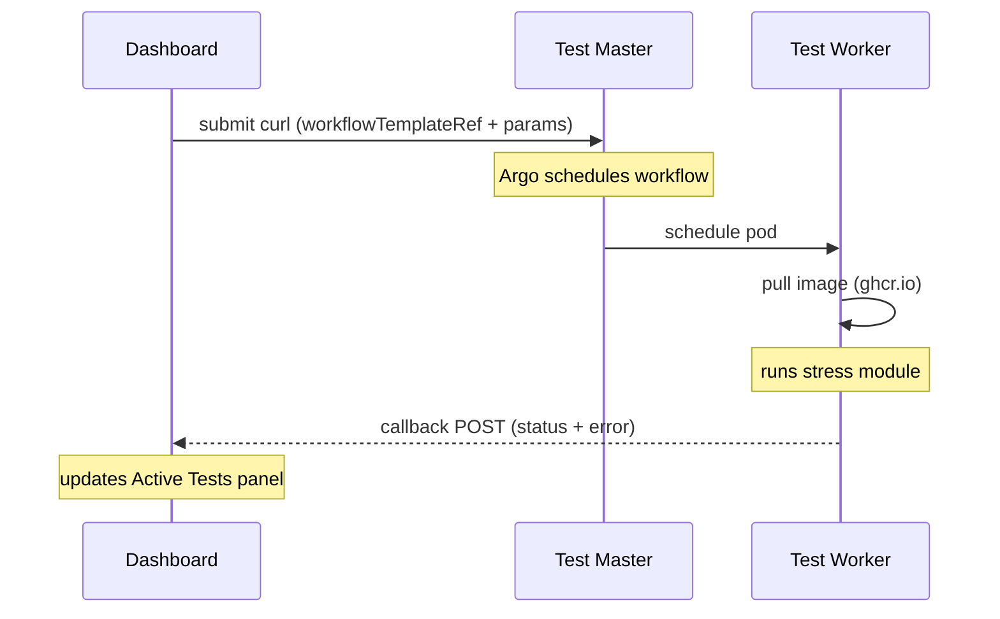
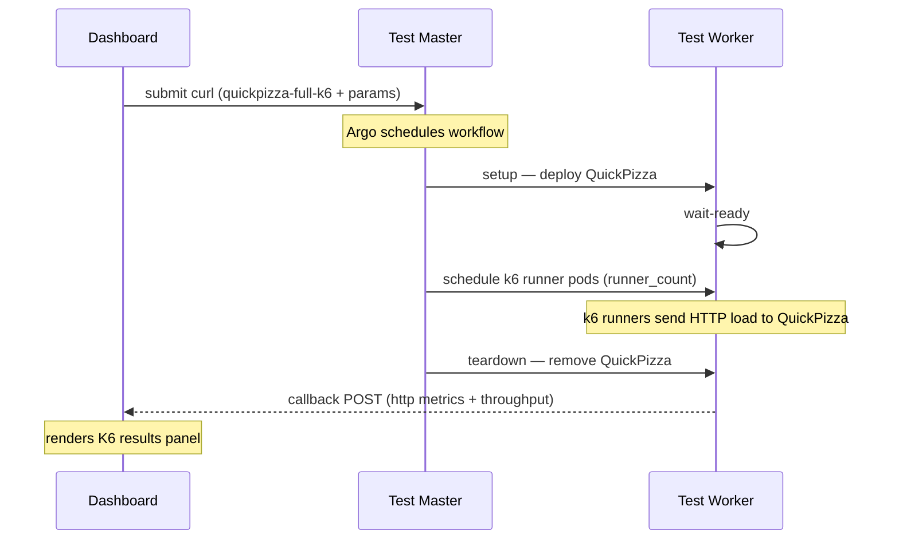

# Stressmaster API Reference
## module-stresser — Stress Modules

> **Audience:** Internal — team / supervisor
> **Base URL:** `https://10.255.32.82:32746`
> **Auth:** Bearer token on every request
> **TLS:** Self-signed cert — use `-k` flag on curl

---

## Authentication

Retrieve token at any time from stressmaster:

```bash
kubectl get secret stress-ui-sa-token -n stress \
  -o jsonpath='{.data.token}' | base64 -d
```

Set environment variables:

```bash
export ARGO="https://10.255.32.82:32746"
export ARGO_TOKEN=$(kubectl get secret stress-ui-sa-token -n stress \
  -o jsonpath='{.data.token}' | base64 -d)
export CALLBACK="http://<ui-vm-ip>:3001/api/callback"
```

Unauthorized response: `{"code": 16, "message": "token not found"}`

---

## Module Overview

| Module | WorkflowTemplate | Primary resource stressed |
|--------|-----------------|--------------------------|
| **CPU** | `cpu-stress-api` | Processor cores and instruction throughput |
| **Memory** | `memory-stress-api` | DRAM read/write bandwidth at configurable rate caps |
| **IO** | `io-stress-api` | Disk read/write throughput and I/O depth |
| **Network** | `network-stress-api` | Network bandwidth and packet throughput |
| **QuickPizza K6** | `quickpizza-full-k6` | HTTP application load via distributed k6 runners |

All modules:
- Run on a specific worker node via `target-node`
- Send an enriched callback on completion or failure via `onExit` — fires regardless of outcome
- CPU and Memory modules validate node resources before spawning

---

## Operations

### List workflows

```bash
curl -sk "${ARGO}/api/v1/workflows/stress" \
  -H "Authorization: Bearer ${ARGO_TOKEN}"
```

### Poll workflow status

```bash
curl -sk "${ARGO}/api/v1/workflows/stress/<name>" \
  -H "Authorization: Bearer ${ARGO_TOKEN}"
```

**Possible phases:** `Pending` · `Running` · `Succeeded` · `Failed` · `Error`

### Terminate a workflow

```bash
curl -sk -X PUT \
  "${ARGO}/api/v1/workflows/stress/<name>/terminate" \
  -H "Authorization: Bearer ${ARGO_TOKEN}" \
  -H "Content-Type: application/json" \
  -d '{}'
```

---

## Submit — CPU Stress

```bash
curl -k -X POST "${ARGO}/api/v1/workflows/stress" \
  -H "Authorization: Bearer ${ARGO_TOKEN}" \
  -H "Content-Type: application/json" \
  -d '{
    "workflow": {
      "metadata": { "generateName": "cpu-ui-" },
      "spec": {
        "workflowTemplateRef": { "name": "cpu-stress-api" },
        "arguments": { "parameters": [
          { "name": "target-node",  "value": "demo" },
          { "name": "workers",      "value": "2" },
          { "name": "load",         "value": "50" },
          { "name": "timeout",      "value": "1m" },
          { "name": "cpuset",       "value": "0-1" },
          { "name": "cpu_req",      "value": "1" },
          { "name": "cpu_lim",      "value": "2" },
          { "name": "callback-url", "value": "'${CALLBACK}'" }
        ]}
      }
    }
  }'
```

| Parameter | Default | Description |
|-----------|---------|-------------|
| `target-node` | `demo` | Worker node hostname |
| `workers` | `1` | Number of stress-ng CPU workers |
| `load` | `50` | CPU load percentage per worker (1–100) |
| `timeout` | `1m` | Duration — accepts `30s`, `1m`, `2h` |
| `cpuset` | `0` | CPU cores to pin workers to (e.g. `0-3`, `0,2`) |
| `cpu_req` | `1` | CPU cores requested from k8s scheduler |
| `cpu_lim` | `1` | CPU cores limit for the pod |
| `callback-url` | `""` | HTTP endpoint to POST results to |

---

## Submit — Memory Stress

```bash
curl -k -X POST "${ARGO}/api/v1/workflows/stress" \
  -H "Authorization: Bearer ${ARGO_TOKEN}" \
  -H "Content-Type: application/json" \
  -d '{
    "workflow": {
      "metadata": { "generateName": "mem-ui-" },
      "spec": {
        "workflowTemplateRef": { "name": "memory-stress-api" },
        "arguments": { "parameters": [
          { "name": "target-node",  "value": "demo" },
          { "name": "workers",      "value": "2" },
          { "name": "size",         "value": "0.5" },
          { "name": "timeout",      "value": "1m" },
          { "name": "read_mbps",    "value": "-1" },
          { "name": "write_mbps",   "value": "-1" },
          { "name": "cpuset",       "value": "0-1" },
          { "name": "cpu_req",      "value": "1" },
          { "name": "cpu_lim",      "value": "2" },
          { "name": "mem_req",      "value": "1Gi" },
          { "name": "mem_lim",      "value": "4Gi" },
          { "name": "callback-url", "value": "'${CALLBACK}'" }
        ]}
      }
    }
  }'
```

| Parameter | Default | Description |
|-----------|---------|-------------|
| `target-node` | `demo` | Worker node hostname |
| `workers` | `1` | Number of memory stress workers |
| `size` | `0.25` | Memory per worker in GB |
| `timeout` | `1m` | Duration |
| `read_mbps` | `-1` | Read throttle in MB/s — `-1` = unlimited |
| `write_mbps` | `-1` | Write throttle in MB/s — `-1` = unlimited |
| `cpuset` | `0` | CPU cores to pin workers to |
| `cpu_req` | `1` | CPU cores requested |
| `cpu_lim` | `1` | CPU cores limit |
| `mem_req` | `1Gi` | Memory requested from k8s scheduler |
| `mem_lim` | `7Gi` | Memory limit — must be >= workers x size GB |
| `callback-url` | `""` | HTTP endpoint to POST results to |

> **Note:** `mem_lim` is enforced by k8s. If `workers x size` exceeds `mem_lim`, the pod is OOMKilled. Recommended: `mem_lim >= workers x size x 1.1`.

---

## Submit — IO Stress

```bash
curl -k -X POST "${ARGO}/api/v1/workflows/stress" \
  -H "Authorization: Bearer ${ARGO_TOKEN}" \
  -H "Content-Type: application/json" \
  -d '{
    "workflow": {
      "metadata": { "generateName": "io-ui-" },
      "spec": {
        "workflowTemplateRef": { "name": "io-stress-api" },
        "arguments": { "parameters": [
          { "name": "target-node",  "value": "demo" },
          { "name": "mode",         "value": "seq-read" },
          { "name": "runtime_sec",  "value": "30" },
          { "name": "target_mbps",  "value": "100" },
          { "name": "target_iops",  "value": "" },
          { "name": "block_size",   "value": "1M" },
          { "name": "iodepth",      "value": "1" },
          { "name": "cpu_req",      "value": "1" },
          { "name": "cpu_lim",      "value": "1" },
          { "name": "mem_req",      "value": "512Mi" },
          { "name": "mem_lim",      "value": "512Mi" },
          { "name": "callback-url", "value": "'${CALLBACK}'" }
        ]}
      }
    }
  }'
```

| Parameter | Default | Description |
|-----------|---------|-------------|
| `target-node` | `demo` | Worker node hostname |
| `mode` | `seq-read` | IO pattern — `seq-read`, `seq-write`, `rand-read`, `rand-write` |
| `runtime_sec` | `30` | Duration in seconds |
| `target_mbps` | `100` | Target throughput in MB/s — empty = unlimited |
| `target_iops` | `""` | Target IOPS — empty = use `target_mbps` instead |
| `block_size` | `1M` | IO block size (e.g. `4K`, `64K`, `1M`) |
| `iodepth` | `1` | Queue depth |
| `cpu_req` | `1` | CPU cores requested |
| `cpu_lim` | `1` | CPU cores limit |
| `mem_req` | `512Mi` | Memory requested |
| `mem_lim` | `512Mi` | Memory limit |
| `callback-url` | `""` | HTTP endpoint to POST results to |

---

## Submit — Network Stress

> **Prerequisite:** iperf3 server must be running on the target host: `iperf3 -s`

```bash
curl -k -X POST "${ARGO}/api/v1/workflows/stress" \
  -H "Authorization: Bearer ${ARGO_TOKEN}" \
  -H "Content-Type: application/json" \
  -d '{
    "workflow": {
      "metadata": { "generateName": "net-ui-" },
      "spec": {
        "workflowTemplateRef": { "name": "network-stress-api" },
        "arguments": { "parameters": [
          { "name": "target-node",  "value": "demo" },
          { "name": "server",       "value": "10.255.32.82" },
          { "name": "bandwidth",    "value": "100" },
          { "name": "proto",        "value": "tcp" },
          { "name": "direction",    "value": "upload" },
          { "name": "time",         "value": "20" },
          { "name": "cpu_req",      "value": "1" },
          { "name": "cpu_lim",      "value": "1" },
          { "name": "mem_req",      "value": "256Mi" },
          { "name": "mem_lim",      "value": "256Mi" },
          { "name": "callback-url", "value": "'${CALLBACK}'" }
        ]}
      }
    }
  }'
```

| Parameter | Default | Description |
|-----------|---------|-------------|
| `target-node` | `demo` | Worker node hostname |
| `server` | `10.255.32.82` | IP of the iperf3 server |
| `bandwidth` | `100` | Target bandwidth in Mbps |
| `proto` | `tcp` | Protocol — `tcp` or `udp` |
| `direction` | `upload` | `upload` (client to server) or `download` (server to client) |
| `time` | `20` | Duration in seconds |
| `cpu_req` | `1` | CPU cores requested |
| `cpu_lim` | `1` | CPU cores limit |
| `mem_req` | `256Mi` | Memory requested |
| `mem_lim` | `256Mi` | Memory limit |
| `callback-url` | `""` | HTTP endpoint to POST results to |

---

## Submit — QuickPizza K6

Deploys QuickPizza dynamically, runs distributed k6 HTTP load against it, and tears down all resources on completion.

```bash
curl -k -X POST "${ARGO}/api/v1/workflows/stress" \
  -H "Authorization: Bearer ${ARGO_TOKEN}" \
  -H "Content-Type: application/json" \
  -d '{
    "workflow": {
      "metadata": { "generateName": "quickpizza-full-k6-" },
      "spec": {
        "workflowTemplateRef": { "name": "quickpizza-full-k6" },
        "arguments": { "parameters": [
          { "name": "run_id",       "value": "benchmark-001" },
          { "name": "target-node",  "value": "demo" },
          { "name": "base_url",     "value": "http://quickpizza-public-api.stress.svc.cluster.local:3333" },
          { "name": "max_vusers",   "value": "100" },
          { "name": "duration",     "value": "30" },
          { "name": "runner_count", "value": "2" },
          { "name": "callback-url", "value": "'${CALLBACK}'" }
        ]}
      }
    }
  }'
```

| Parameter | Default | Description |
|-----------|---------|-------------|
| `target-node` | `demo` | Worker node hostname |
| `run_id` | — | Unique identifier for this execution |
| `base_url` | — | QuickPizza API endpoint inside the cluster |
| `max_vusers` | `100` | Maximum concurrent virtual users |
| `duration` | `30` | Test duration in seconds |
| `runner_count` | `2` | Number of parallel k6 runner pods |
| `callback-url` | `""` | HTTP endpoint to POST results to |

### Workflow steps

```
setup -> wait-ready -> k6-runner -> callback -> teardown
```

- QuickPizza is deployed and removed automatically — no persistent deployment needed
- k6 execution is distributed across `runner_count` pods

---

## Callback Payloads

All modules POST to `callback-url` on completion or failure via `onExit`.

### Stress modules — success

```json
{
  "workflow": "cpu-ui-abc12",
  "status": "Succeeded",
  "test_type": "cpu",
  "error": null,
  "parameters": { "target": "demo", "workers": "2", "load": "50", "timeout": "1m" },
  "started": "2026-05-14T10:00:00Z",
  "duration": "62.4"
}
```

### Stress modules — failure

```json
{
  "workflow": "mem-ui-xyz99",
  "status": "Failed",
  "test_type": "memory",
  "error": {
    "type": "resource_exhaustion",
    "reason": "OOMKilled",
    "message": "Container killed — memory limit exceeded. Lower size or mem_lim."
  },
  "parameters": { "target": "demo", "size_gb": "4", "timeout": "1m", "workers": "2" },
  "started": "2026-05-14T10:05:00Z",
  "duration": "8.1"
}
```

### QuickPizza K6 — success

```json
{
  "workflow": "quickpizza-full-k6-abc12",
  "status": "Succeeded",
  "benchmark": "quickpizza",
  "target": "demo",
  "results": {
    "http_req_duration_avg_ms": 63.95,
    "http_req_failed_rate": 0,
    "requests": 523,
    "throughput_rps": 48.36,
    "vus_max": 100
  }
}
```

---

## Error Type Reference

| `error.type` | `error.reason` | When | Action |
|---|---|---|---|
| `resource_exhaustion` | `OOMKilled` | Memory limit hit during run | Lower `size`, `workers`, or raise `mem_lim` |
| `config_error` | `ImagePullBackOff` | Image not found or registry unreachable | Check image name and worker network |
| `config_error` | `CreateContainerConfigError` | Missing volume, secret, or configmap | Check cluster config |
| `bad_params` | `ExitCode1` | Script exited with error — bad parameter values | Check parameter values |
| `stress_error` | `ExitCode<N>` | Unexpected non-zero exit | Check pod logs |
| `workflow_error` | `NoPodFound` | Failed before pod was scheduled | Check node schedulability |

---

## Sequence Diagrams

### Stress Test Flow



### QuickPizza K6 Flow



---

## Quick Reference

```bash
# set env vars once
export ARGO="https://10.255.32.82:32746"
export ARGO_TOKEN=$(kubectl get secret stress-ui-sa-token -n stress \
  -o jsonpath='{.data.token}' | base64 -d)
export CALLBACK="http://<ui-vm-ip>:3001/api/callback"

# list all workflows
curl -sk "${ARGO}/api/v1/workflows/stress" \
  -H "Authorization: Bearer ${ARGO_TOKEN}" | python3 -m json.tool

# poll a specific workflow
curl -sk "${ARGO}/api/v1/workflows/stress/<name>" \
  -H "Authorization: Bearer ${ARGO_TOKEN}" \
  | python3 -m json.tool | grep '"phase"'

# terminate a workflow
curl -sk -X PUT "${ARGO}/api/v1/workflows/stress/<name>/terminate" \
  -H "Authorization: Bearer ${ARGO_TOKEN}" \
  -H "Content-Type: application/json" -d '{}'

# extract workflow name from submit response
curl -sk -X POST "${ARGO}/api/v1/workflows/stress" \
  -H "Authorization: Bearer ${ARGO_TOKEN}" \
  -H "Content-Type: application/json" \
  -d '{...}' | python3 -c "import sys,json; print(json.load(sys.stdin)['metadata']['name'])"
```